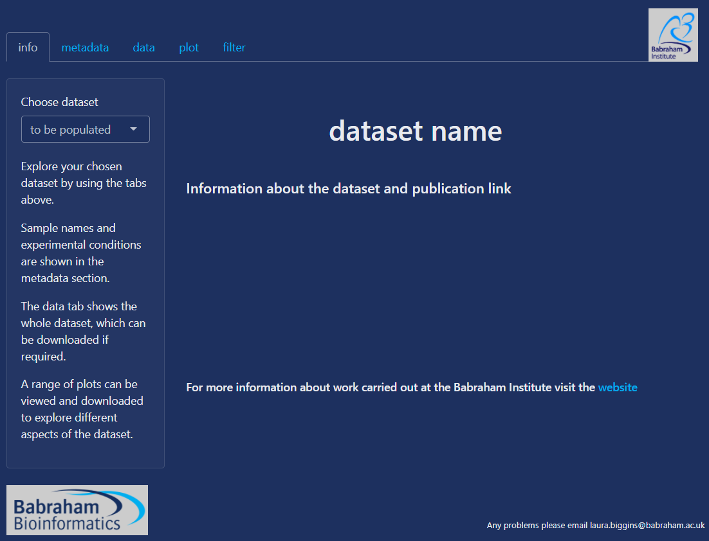
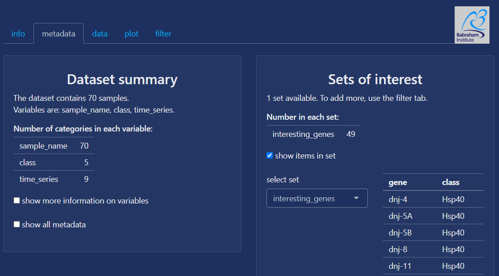
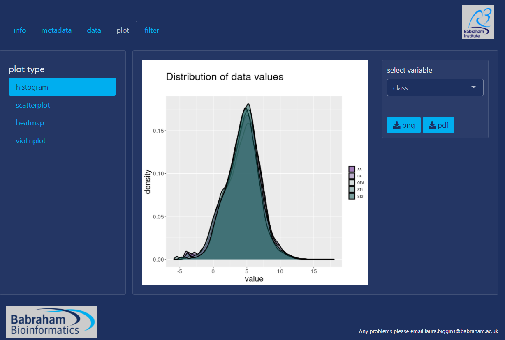

<!-- README.md is generated from README.Rmd. Please edit that file -->

```{r, include = FALSE}
knitr::opts_chunk$set(
  collapse = TRUE,
  comment = "#>",
  fig.path = "man/figures/README-",
  out.width = "100%"
)
```

# spex

<!-- badges: start -->
[](https://www.tidyverse.org/lifecycle/#experimental)
<!-- badges: end -->

The goal of spex is to provide an online tool for simple exploration of biological 
datasets.

It is currently running [here](https://www.bioinformatics.babraham.ac.uk/shiny/spex/spex/) on the Babraham shiny server with an example dataset.  

The initial page currently looks like this:

   
The tabs allow the user to explore a dataset, metadata information and an example plot are shown below.  

   

   
   
```{r first_page, echo = FALSE, eval = FALSE}
plot(start_page_screenshot)
```

## Preparing data 

### Main data file  

A data file where each row contains a different genes (or other markers), and each column
contains a different sample e.g.

### Metadata file
sample names in the first column that must match the column names in the main dataset,
then conditions in subsequent columns e.g.

| sample_name | class  | time_series |
|-------------|--------|-------------|
| DAO06 | DA | 1440 |
| DAO09 | DA | 1440 |
| OEA098 | OEA | 240 |
| OEA068 | OEA | 960 |
| OEA101 | OEA | 960 |

Keep the name of the first column as "sample_name" - it's simpler for processing.


## Installation

This is currently under initial development and has not been released.

```{r, eval = FALSE, echo = FALSE}
# You'll still need to render `README.Rmd` regularly, to keep `README.md` up-to-date. `devtools::build_readme()` is handy for this. You could also use GitHub Actions to re-render `README.Rmd` every time you push. An example workflow can be found here: <https://github.com/r-lib/actions/tree/master/examples>.
```
