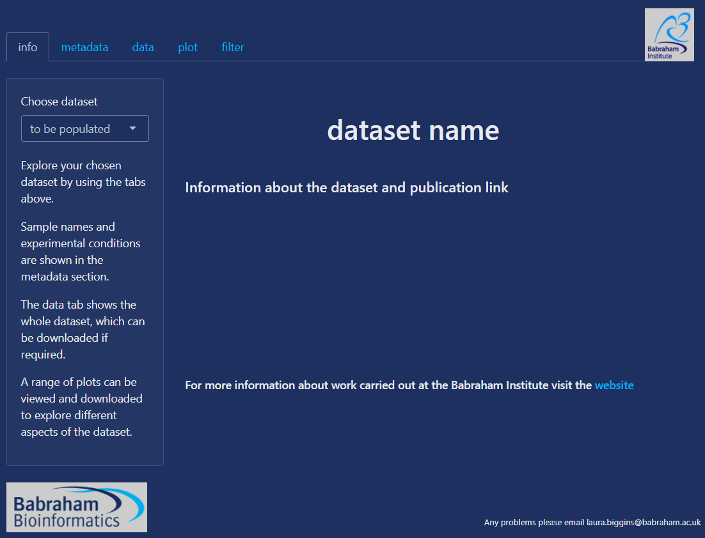
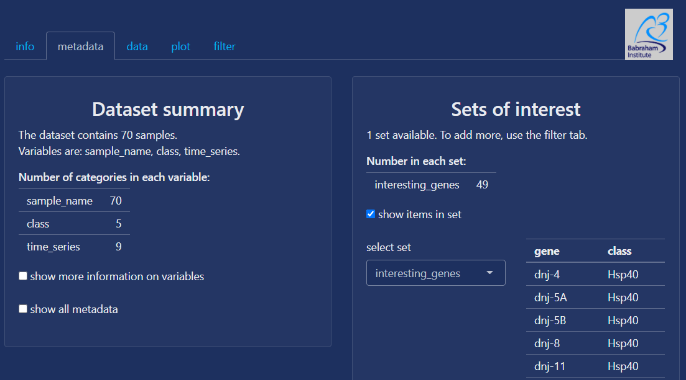
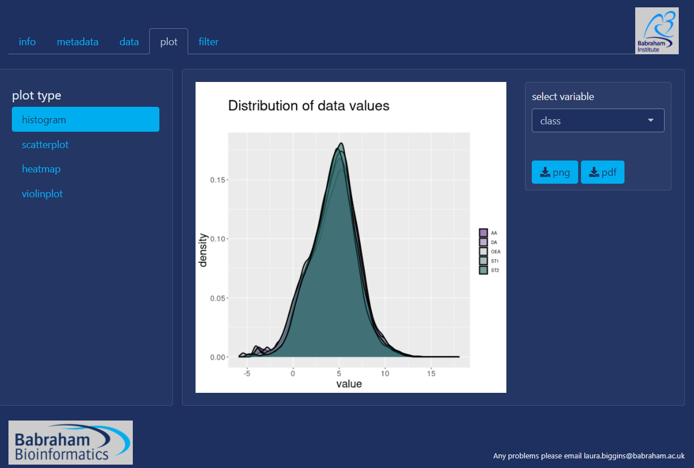

<!-- README.md is generated from README.Rmd. Please edit that file -->

# spex

<!-- badges: start -->

<!-- badges: end -->

The goal of spex is to provide an online tool for simple exploration of
biological datasets.

It is currently running
[here](https://www.bioinformatics.babraham.ac.uk/shiny/spex/spex/) on
the Babraham shiny server with an example dataset.

The initial page currently looks like this:

The tabs allow the user to explore a dataset, metadata information and
an example plot are shown below.  

## Installation

This is currently under initial development and has not been released.
